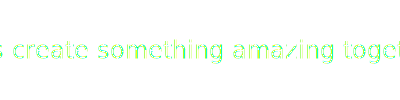

# 💫 About Me:
 Hi, I’m **Ankush Singh**  
👀 I’m interested in **Data Structures and Algorithms**  
🌱 I’m currently learning **Web Development**  
💞️ I’m looking to collaborate on **MERN stack projects**  
📫 How to reach me: **Email - [ankushsingh20000003@gmail.com](mailto:ankushsingh20000003@gmail.com)**

## 🌐 Socials:
 

# 💻 Tech Stack:

 

## 📈 GitHub Stats:

## 🏆 Achievements:
- 🥇 Solved over **900+ problems** on LeetCode
- 🥈 Knight on LeetCode
- 🥉 Created **5+ MERN full-stack projects** with deployment

## ✨ Feel free to connect with me on [LinkedIn](https://www.linkedin.com/in/ankush-singh-/) or reach out via <a href="mailto:ankushsingh20000003@gmail.com" style="text-decoration: none; color: inherit;">Email - ankushsingh20000003@gmail.com</a>!

---

<!---
ankush788/ankush788 is a ✨ special ✨ repository because its `README.md` (this file) appears on your GitHub profile.
You can click the Preview link to take a look at your changes.
--->
